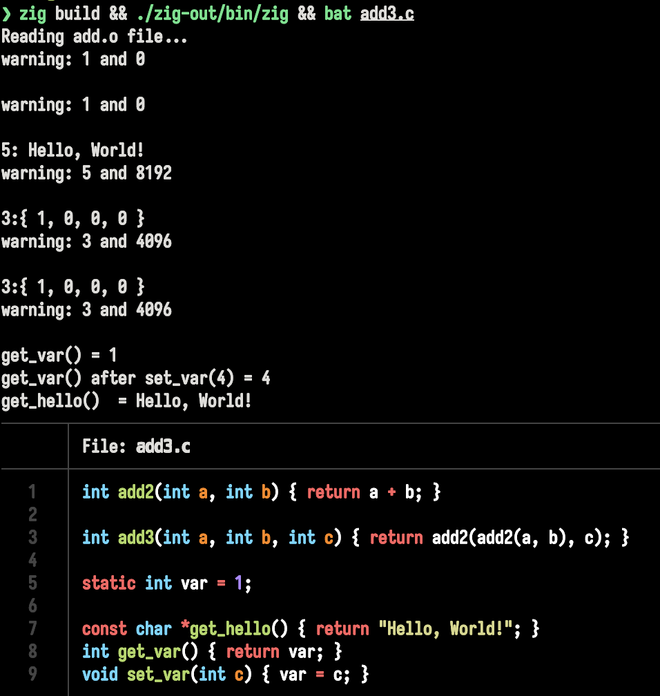

## Progress

- Currently reads an add function from `add.o` and executes it from zig.
- Performs relocation for static .o functions for function calls, global variables and strings(text,data and rodata respectively).



To compile add.c:

> [!WARNING]
> Do not use gcc, theres an endbr64 instruction on the top that causes issues

```bash
clang -c add.c -o add.o

# Alternatively you can use the zig c compiler

zig cc -c add.c -o add.o
```

To execute the add function via zig:

```bash
zig build run
```


## References

- [Cloudflare blogs](https://blog.cloudflare.com/how-to-execute-an-object-file-part-1/)
